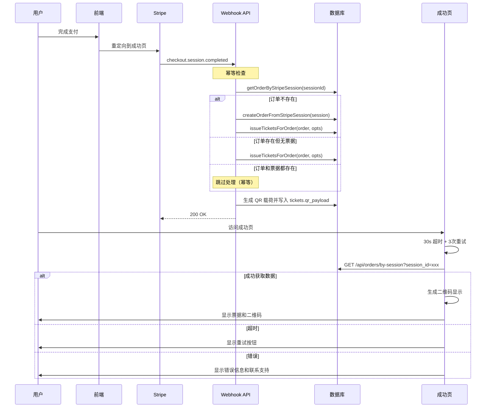

# QR 票据生成流程

> PR-5: 订单→出票→二维码完整流程文档  
> 更新时间: 2024年10月

## 📋 概述

本文档描述了从 Stripe 支付完成到用户获得二维码票据的完整流程，包括幂等性保障、错误处理和用户体验优化。

---

## 🔄 完整流程时序图



---

## 🔐 幂等性保障

### 1. Webhook 幂等策略

```javascript
// 检查是否已有订单和票据
const existingOrder = await getOrderByStripeSession(session.id)

if (existingOrder && existingOrder.tickets.length > 0) {
  // 已存在，跳过处理
  return { ok: true, skipped: true }
}

// 创建或获取订单
let order = existingOrder || await createOrderFromStripeSession(session)

// 出票（内部也有幂等检查）
const tickets = await issueTicketsForOrder(order, opts)
```

### 2. 数据层幂等检查

```javascript
// issueTicketsForOrder 内部检查
const existingTickets = await supabaseAdmin
  .from('tickets')
  .select('*')
  .eq('order_id', order.id)

if (existingTickets.length > 0) {
  return existingTickets.map(mapDbToModel)
}
```

---

## 🎫 二维码生成

### 1. 服务端生成 QR 载荷

```javascript
function generateQRPayload(data) {
  const crypto = require('crypto')
  const salt = process.env.QR_SALT
  
  const payload = {
    ...data,
    sig: crypto
      .createHmac('sha256', salt)
      .update(JSON.stringify(data))
      .digest('hex')
      .substring(0, 16)
  }
  
  return JSON.stringify(payload)
}
```

### 2. 客户端渲染二维码

```javascript
// 从服务端 qr_payload 生成二维码图片
const qrDataURL = await QRCode.toDataURL(ticket.qrPayload, {
  width: 256,
  margin: 2,
  color: { dark: '#000000', light: '#FFFFFF' },
  errorCorrectionLevel: 'M'
})
```

---

## ⏱️ 成功页超时与重试

### 1. 超时策略

- **超时时间**: 30秒
- **重试次数**: 最多3次
- **退避策略**: 5s, 10s, 15s

### 2. 4种UI状态

| 状态 | 描述 | 用户操作 |
|------|------|----------|
| `loading` | "Generating QR Code..." | 等待 |
| `success` | 显示票据和二维码 | 查看/下载 |
| `timeout` | "Taking longer than usual" | 重试按钮 |
| `error` | "Failed to load tickets" | 重试/联系支持 |

### 3. 实现代码

```javascript
const fetchOrderData = async (sessionId, attempt = 1) => {
  const maxRetries = 3
  const timeoutMs = 30000
  
  const abortController = new AbortController()
  const timeout = setTimeout(() => abortController.abort(), timeoutMs)
  
  try {
    const response = await fetch(`/api/orders/by-session?session_id=${sessionId}`, {
      signal: abortController.signal
    })
    
    clearTimeout(timeout)
    return await response.json()
    
  } catch (error) {
    clearTimeout(timeout)
    
    if (attempt < maxRetries) {
      const delay = attempt * 5000
      await new Promise(resolve => setTimeout(resolve, delay))
      return fetchOrderData(sessionId, attempt + 1)
    }
    
    throw error
  }
}
```

---

## 📊 API 契约

### 1. by-session API 响应格式

#### 成功响应
```json
{
  "ok": true,
  "order": {
    "id": "order_123",
    "sessionId": "cs_xxx",
    "email": "user@example.com",
    "eventId": "event_123",
    "tier": "regular",
    "amount": 1500,
    "currency": "usd",
    "status": "paid",
    "createdAt": "2024-10-25T10:00:00Z",
    "ticketCount": 1
  },
  "tickets": [
    {
      "id": "ABC12345",
      "eventId": "event_123",
      "tier": "regular",
      "holderEmail": "user@example.com",
      "status": "unused",
      "issuedAt": "2024-10-25T10:00:00Z",
      "usedAt": null,
      "qrPayload": "{\"code\":\"ABC12345\",\"eventId\":\"event_123\",...}"
    }
  ]
}
```

#### 错误响应
```json
{
  "ok": false,
  "code": "ORDER_NOT_FOUND" | "MISSING_PARAM" | "INTERNAL_ERROR",
  "message": "Order not found"
}
```

### 2. 错误码说明

| 错误码 | HTTP状态 | 描述 |
|--------|----------|------|
| `MISSING_PARAM` | 400 | 缺少 session_id 参数 |
| `ORDER_NOT_FOUND` | 404 | 订单不存在 |
| `INTERNAL_ERROR` | 500 | 服务器内部错误 |

---

## 🔍 结构化日志

### 1. Webhook 日志格式

```javascript
console.log('[StripeWebhook] Successfully processed order and tickets:', {
  orderId: order.id,
  ticketCount: tickets.length,
  ticketIds: tickets.map(t => t.shortId),
  duration_ms: Date.now() - startTime
})
```

### 2. API 日志格式

```javascript
console.log('[OrdersBySession] Retrieved order', {
  fn: 'orders/by-session',
  sessionId: sessionId.substring(0, 8),
  duration_ms: Date.now() - startTime,
  supabaseError: error.code
})
```

### 3. 成功页日志格式

```javascript
console.log('[SuccessPage] Successfully loaded order data:', {
  orderId: data.order.id,
  ticketCount: data.tickets.length,
  attempt: attempt
})
```

---

## 🧪 验证脚本

### 1. Webhook 幂等测试

```bash
node scripts/smoke-webhook.mjs
```

**验证点**:
- 第一次调用创建订单和票据
- 第二次调用不重复创建
- 相同 session 只产生一组票据

### 2. by-session API 测试

```bash
node scripts/smoke-by-session.mjs
```

**验证点**:
- 正常情况返回正确数据
- 缺少参数返回 400 错误
- 不存在订单返回 404 错误
- 响应格式符合契约

---

## ⚠️ 风险点与缓解

### 1. 重复出票风险

**风险**: Webhook 重复触发导致重复出票  
**缓解**: 多层幂等检查（订单级 + 票据级）

### 2. 超时风险

**风险**: 用户等待时间过长  
**缓解**: 30s 超时 + 3次重试 + 明确错误态

### 3. 数据不一致

**风险**: 订单创建成功但票据创建失败  
**缓解**: 事务性操作 + 结构化日志 + 人工干预标记

---

## 📚 相关文档

- [PR-5 描述](../PR-5_DESCRIPTION.md)
- [字段映射文档](../docs/FIELD_MAPPING_V2.md)
- [RLS 策略指南](../docs/RLS_GUIDE.md)
- [数据访问层](../lib/db/index.ts)

---

## 🔗 相关 PR

- **PR-2**: 字段/关系/状态映射 ✅
- **PR-3**: RLS/Policy 上线 ✅  
- **PR-4**: 活动详情页接入新数据层 ✅
- **PR-5**: 订单→出票→二维码完整流程 ✅
